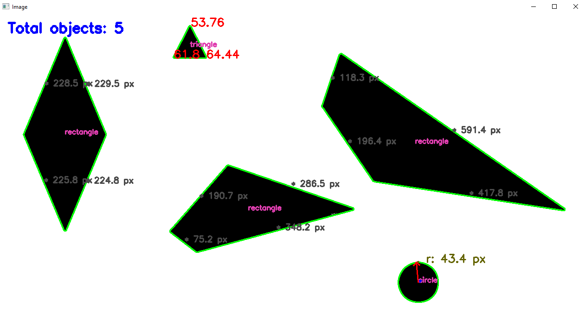

## Download and install!

Python  
[https://www.python.org/downloads/](https://www.python.org/downloads/)

Do not forget to install OpenCV packages for Python.

To run python script:
- You can use your favorite Python IDE (I use [PyCharm](https://www.jetbrains.com/pycharm/))
- If you are looking for very lightweight IDE use [Geany](https://www.geany.org/). It opens very fast. I use it for simple projects
    - You will have to <b>configure</b> Geany for Python.

- Look inside this website to see different ways to run Python script! [How to run Python script](https://pythonbasics.org/execute-python-scripts/)

### Before and after Python script table.

Table below shows 2 out 5 existing pictures in 'pictures_before_script' folder. Feel free to add more and run the script. All picture variables are in 'PythonOpenCV.py' file from line 57 to 62. Feel free to pick any one you want using '#' as comment.

This script only calculates angles for **_triangles_**!

<table>
  <tr>
    <th>Before</th>
    <th>After</th>
  </tr>
  <tr>
    <td></td>
    <td></td>
  </tr>
  <tr>
    <td></td>    
    <td></td>
  </tr>
  <tr>
    <td></td>    
    <td></td>
  </tr>
</table>